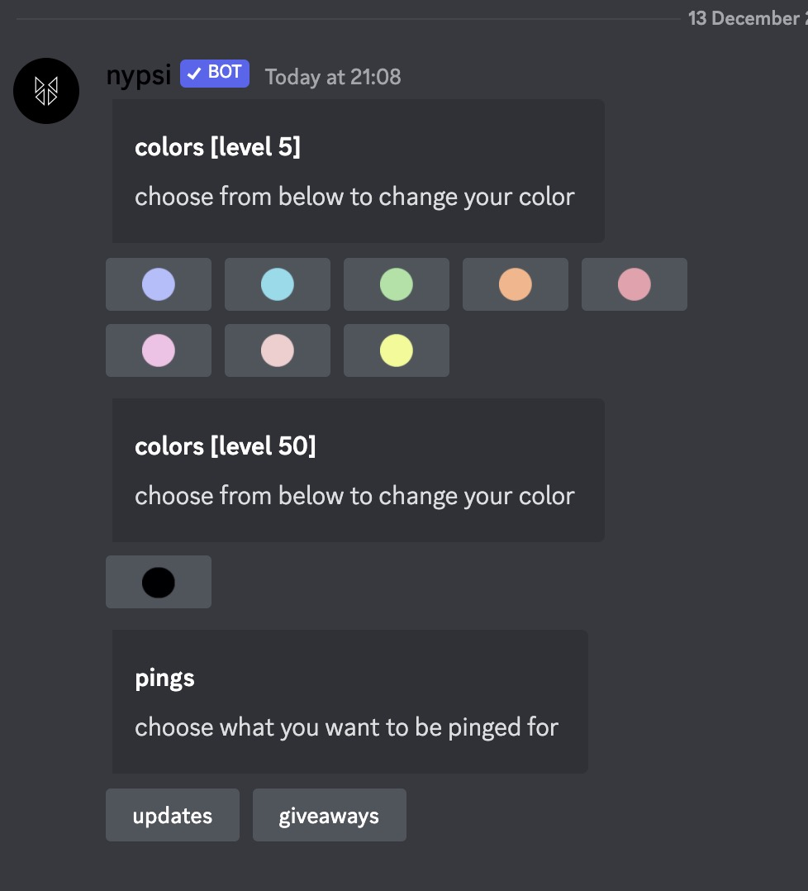
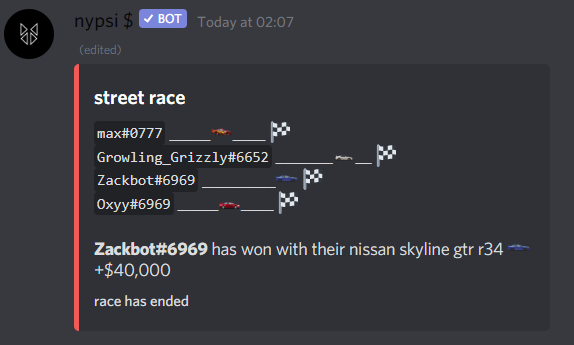
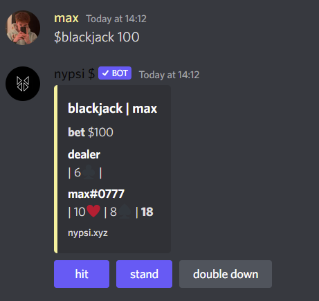
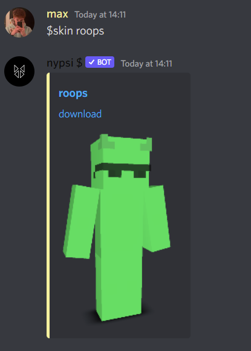
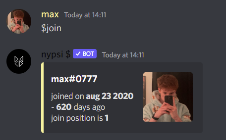
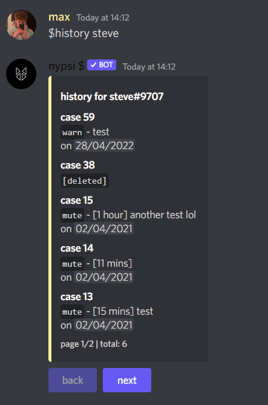
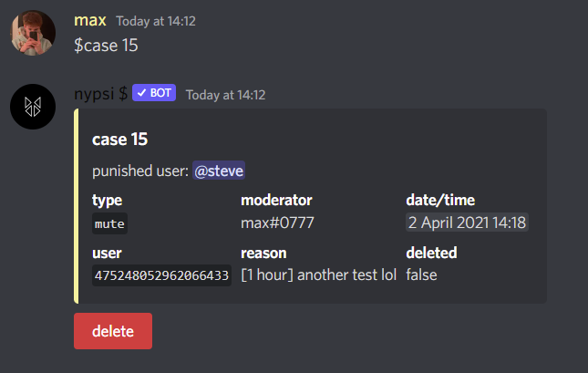

# nypsi

  
  
   
  

## add to your server

invite link can be found at: [`nypsi.xyz/invite`](https://nypsi.xyz/invite)

## documentation

the documentation can be found at [`nypsi.xyz/docs`](https://nypsi.xyz/docs)

## self host

[setup tutorial](https://nypsi.xyz/docs/self-host)

## top.gg

top.gg url: [`https://top.gg/bot/678711738845102087`](https://top.gg/bot/678711738845102087)

## support

join the support server: [`https://discord.gg/hJTDNST`](https://discord.gg/hJTDNST) or add me `@m.axz`

## premium

gimme ur moneis ):< - haha joking but seriously check out the online shop!! it allows you to get cool benefits as well as support nypsi's development: [https://ko-fi.com/tekoh](https://ko-fi.com/tekoh)

## features

better showcase of features can be found on the bot's website: [`nypsi.xyz`](https://nypsi.xyz)

### reaction roles

- incredibly easy & fast to set up and get going reaction roles, different modes to allow for unique roles or having many at a time.
- set a whitelist to have exclusive self roles

### mentions

- nypsi tracks mentions / pings across qualifying servers, preventing your users from being irritated by ghost pings, as well as putting all of their recent mentions into a simple, easy access command

### wordle

- you can play wordle on discord, with nypsi. no limit to how much you play per day

#### gambling / economy

- nypsi has a seasonal economy system, meaning that the economy resets every few months. this also means that the top 5 richest users on the bot at the end of every season receive real life rewards, such as paypal money or equivalent

#### moderation

- every `ban, kick, mute, warn, unban and unmute` that is ran through nypsi is logged and saved and can be accessed with the `$history` and `$case` commands. with all of these commands you are also able to punish multiple people in the same command. use `$help mod` to view all of the moderation commands available. you are also able to moderate the `$snipe / $esnipe` command by including a filter with `$sf`

#### server stats

- nypsi tracks every server's member peaks, this information can be viewed with `$server`
- nypsi is also able to create a member counter for your server, similar to other bots but allows you to customise it for free - `$counter`

#### christmas countdown

- 24/7 running christmas countdown, updates daily
- sends a message to a specified channel once everyday with a customisable message

#### fun commands

- there are a lot of fun commands available for use, including `$reddit` which allows you to grab a random image from any subreddit, as well as `$ddos` which will generate a _fake_ ip address
- very simple method of creating small/large polls with the `$poll` command

#### guilds

- nypsi has a guild feature similar to hypixel's where you can create a guild, invite friends and grow it together.
- guild upgrades will allow guild members to receive global perks on nypsi (such as xp, multipliers, etc)
- grow your guild and level up to become the top and receive awesome perks

## screenshots

- `$rr`

- `$wordle`

- `$streetrace`

- `$blackjack`

- `$skin`

- `$join`

- `$history`

- `$case`

