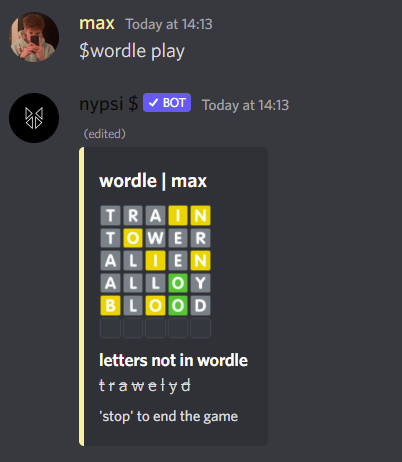

# nypsi

  
  
  
   
  

### 🍟 invite / use in your server

invite link can be found at: [`invite.nypsi.xyz`](http://invite.nypsi.xyz)

### 📔 documentation

the documentation can be found at [`docs.nypsi.xyz`](https://docs.nypsi.xyz)

### 🏗 installation / cloning

[setup tutorial](https://github.com/tekoh/nypsi/blob/main/SETUP.md)

### 🍪 top.gg

top.gg url: [`https://top.gg/bot/678711738845102087`](https://top.gg/bot/678711738845102087)

### 🌴 support

join the support server: [`https://discord.gg/hJTDNST`](https://discord.gg/hJTDNST) or add me `max#0777`

### 💰 patreon

gimme ur moneis ):< - haha joking but seriously check out the patreon it would help me massively, you also get benefits with the bot!!! [`https://patreon.com/nypsi`](https://patreon.com/nypsi)

### 🌵 features

better showcase of features can be found on the bot's website: [`nypsi.xyz`](https://nypsi.xyz)

##### 💬 mentions

-   nypsi tracks mentions across qualifying servers, preventing your users from being irritated by ghost pings, as well as putting all of their recent mentions into a simple, easy access command

#### 📖 wordle

-   you can play wordle on discord, with nypsi. no limit to how much you play per day

##### 💸 gambling / economy

-   nypsi has a seasonal economy system, meaning that the economy resets every few months. this also means that the top 5 richest users on the bot at the end of every season receive real life rewards, such as paypal money or equivalent

##### 🛠 moderation

-   every `ban, kick, mute, warn, unban and unmute` that is ran through nypsi is logged and saved and can be accessed with the `$history` and `$case` commands. with all of these commands you are also able to punish multiple people in the same command. use `$help mod` to view all of the moderation commands available. you are also able to moderate the `$snipe / $esnipe` command by including a filter with `$sf`

##### ⛏ minecraft

-   `[disclaimer]` - this bot is not affiliated with minecraft/mojang in any way there are two minecraft related commands being `$mc` and `$skin`, both allow you to view information about a minecraft account, including past names and their current skin

##### 📊 server stats

-   nypsi tracks every server's member peaks, this information can be viewed with `$server`
-   nypsi is also able to create a member counter for your server, similar to other bots but allows you to customise it for free - `$counter`

##### 🎅 christmas countdown

-   24/7 running christmas countdown, updates daily
-   sends a message to a specified channel once everyday with a customisable message

##### 🎮 fun commands

-   there are a lot of fun commands available for use, including `$reddit` which allows you to grab a random image from any subreddit, as well as `$ddos` which will generate a _fake_ ip address
-   very simple method of creating small/large polls with the `$poll` command

##### ✅ information

-   nypsi is able to calculate join positions and join dates of any user in any server, this can be seen with `$join` or `$user`
-   there is also a `$lookup` command which allows you to lookup information about domain names and IP addresses

### 🖼 screenshots

-   `$wordle`

-   `$mc`

-   `$streetrace`

-   `$blackjack`

-   `$skin`

-   `$join`

-   `$history`

-   `$case`

